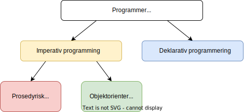

# Når og hvorfor brukes objektorientert programmering?

## Programmeringsparadigmer

Grunnleggende sett handler programmering om å gjøre operasjoner på data. Vi kan for eksempel gjøre operasjoner på punkter i planet, slik som å regne ut avstand:

```py
p = (3, 4)
q = (1, 5)
o = (0, 0)

avstand_p_q = sqrt((p[0]-q[0])^2+(p[1]-q[1])^2))
avstand_q_o = sqrt((q[0]-o[0])^2+(q[1]-o[1])^2))
```
Her gir vi datamaskinen en rekke kommandoer som skal utføres i sekvens. Det er lett å tenke at all programmering er slik, men det finnes programmeringsspåk der man beskriver hva som er ønsket resultat uten å gi slike kommandoer. 

*Hvis du har tatt Informasjonsteknologi 1, så har du skrevet databasespørringer. Dette er også programmering, der vi gir datamaskinen en presis beskrivelse av tabellen vi ønsker å få ut, og datamaskinen omformer selv denne beskrivelsen til en rekke steg som må utføres.*

Å skrive en sekvens med kommandoer kalles *imperativ programmering*, mens å beskrive ønsket resultat (for eksempel en databasespørring) kalles *deklarativ programmering*. Følgende diagram viser noen av måtene å programmere på:



De ulike måtene kalles gjerne *programmeringsparadigmer*. Ulike språk benytter seg av ulike paradigmer, eller en kombinasjon. Java er et typisk objektorientert (og dermed også imperativt) programmeringsspråk, mens SQL er et deklarativt språk. Vi skal bruke Python, som befinner seg på venstre side av diagrammet, men som ellers er allsidig. Med Python gir vi altså konkrete kommandoer til datamaskinen, men vi har stor frihet til å benytte oss av ulike paradigmer i den imperative grenen. 

Målet er at du skal utvide din vektøykasse med nye måter å programme på, og ta i bruk paradigmer som er egnet for problemstillingene du møter. I dette kapittelet skal vi beskrive når og hvorfor objekorientert programmering er nyttig. Vi ser først på et paradigme du antagelig har brukt allerede.

## Det prosedyriske paradigmet

I forrige seksjon så vi et program som regner ut avstand mellom punkter. Du så kanskje at vi gjorde samme utregning to ganger? Matematiske utregninger plasseres gjerne i funksjoner:

```py
def avstand(a, b):
    sqrt((a[0]-b[0])^2+(a[1]-b[1])^2))

avstand_p_q = avstand(p, q)
avstand_q_o = avstand(q, o)
```
Vi har nå tatt i bruk prosedyrisk programmering! Det handler rett og slett om å bruke prosedyrer, også kalt funksjoner. Mange vil si at funksjoner er den mest grunnleggende strukturen i matematikk. Derfor er prosedyrisk programmering det naturlige valget når vi skal gjøre matematiske beregninger. 

Med prosedyrisk programmering ønsker vi å separere funksjoner og data, slik at funksjonene kan ta imot data fra svært ulike kilder. Matematiske funksjoner er jo nettopp slik - ikke begrenset til et spesifikt formål, men nyttige i mange ulike situasjoner. For eksempel kan avstandsfunksjonen være like aktuell for behandling av kartdata som for sykdomsdiagnostisering (punktene kan være datapunkter som representerer celleprøver). 

## Det objektorienterte paradigmet

Når vi bruker programmering for matematiske beregninger, lager vi en slags utvidet kalkulator. Men: 

- En kalkulator er spesifikk - den gjør visse utregninger med tall. 
- En datamaskin er universell - den kan behandle alle typer data, og gjøre enhver operasjon som kan beskrives med en presis algoritme. 

Som programmerer møter man komplekse problemer som ikke nødvendigvis handler om tall og beregninger. Da må vi utnytte datamaskinens universelle natur, og ikke begrense oss til ett paradigme. Å alltid separere data og funksjoner kan være en slik begrensning. Med objektorientering kan vi i stedet knytte sammen data og funksjoner som hører sammen. Vi skal vise når dette er nyttig gjennom et eksempel.

Se for deg at du koder et prosedyrisk program for å skrive en hilsen til personer:

```py
def skriv_hilsen(navn):
    return "Hei, " + navn + "!" + "Takk for meldingen. Håper du har det bra! Hilsen meg."

person1_navn = "Geir"
person2_navn = "Kari"
skriv_hilsen(person1_navn)
skriv_hilsen(person2_navn)
```
Dersom vi ønsker en annen hilsen, trenger vi kun å endre koden i funksjonen. Det er en viktig styrke ved prosedyrisk programmerig. Men hva om vi ønsker å bruke mer data enn bare navnet? Kanskje vi vet når vi sist fikk melding fra hver person, og ønsker å bruke dette til å skrive en mer personlig hilsen:

```py
def skriv_hilsen(navn, dato_for_siste_melding):
    return "Hei, " + navn + "!" + "Takk for meldingen du sendte meg den " + dato_for_siste_melding + ". Håper du har det bra! Hilsen meg."

person1_navn = "Geir"
person2_navn = "Kari"
person1_dato_for_siste_melding = "2. februar"
person2_dato_for_siste_melding = "15. april"
skriv_hilsen(person1_navn, person1_dato_for_siste_melding)
skriv_hilsen(person2_navn, person2_dato_for_siste_melding)
```
Her måtte vi gjøre mange endringer, og koden har allerede blitt ganske stygg! Merk at vi må endre parameterlisten alle steder funksjonen kalles. Et større program kan ha veldig mange funksjonskall, og da blir slike endringer svært langtekkelig og repetitivt, noe vi nettopp ønsker å unngå når vi programmerer. Så hvordan kan vi løse dette? Vi vet at funksjonen `skriv_hilsen`kun skal behandle en type data, nemlig data om personer. Det kan vi utnytte. 

Situasjonen er altså at vi har to datavariabler (`navn ` og `dato_for_siste_melding`) og en funksjon (`skriv_melding`) . Hva har disse til felles? De har med en person å gjøre! Med objektorientert programmering kan vi lage en "boks" som inneholder alt som handler om en person, både data og funksjoner. Dette kalles en *klasse* (*class*):

```py
class Person:
    navn
    dato_for_siste_melding

    def skriv_hilsen()
        return "Hei, " + self.navn + "!" + "Takk for meldingen du sendte meg den " + self.dato_for_siste_melding + ". Håper du har det bra! Hilsen meg."
```
Merk at vi ikke gir verdier til variablene. Det er fordi klassen `Person` ikke definerer en spesifikk person, men er en *mal* som forteller hva en person skal inneholde av data og funksjoner. Vi kan bruke denne malen til å definere en spesifikk person:

```py
person1 = Person()
person1.navn = "Geir" 
person1.dato_for_siste_melding = "2. februar"
```
Her oppretter vi altså et `Person`-objekt (som får en spesifikk plass i datamaskinens minne) og setter inn data til objektet. Hvis du har brukt Python, så har du opprettet mange objekter - alt er nemlig objekter i Python!  Når du skriver `mitt_tall=-4`, så opprettes egentlig et `int`-objekt, og verdien -4 settes inn i objektet. Deretter kan du gjøre `int`-operasjoner på objektet, for eksempel skrive `mitt_tall.abs()` for å finne absoluttverdien til tallet. På samme måte kan vi gjøre `Person`-operasjoner på `Person`-objektet vårt. Vi har foreløpig bare en slik operasjon:

```py
person1.skriv_melding()
```
Siden funksjonen brukes på et spesifikt `Person`-objekt, og objektet inneholder alle data om personen, trenger vi ingen parametre! Nå blir det enkelt å endre funksjonen. Kanskje ønsker vi å bruke bursdagen til hver person, for å gjøre meldingen enda mer personlig. Da endrer vi først `Person`-klassen, altså malen for personobjekter:

```py
class Person:
    fornavn
    dato_for_siste_melding
    bursdag

    def skriv_hilsen():
        return "Hei, " + self.navn + "!" + "Takk for meldingen du sendte meg den " + self.dato_for_siste_melding + ". Håper du har det bra, og til lykke med dagen den" + self.bursdag + "!" + " Hilsen meg."
```
Vi oppretter nå et nytt `Person`-objekt fra denne klassen:

```py
person2 = Person()
person2.navn = "Kristine"
person2.dato_for_siste_melding = "1. mars"
person2.bursdag = "13. januar"
person2.skriv_melding()
```
Disse linjene er lett å lese, og trenger aldri å endres senere. Selv i et lite program ser vi altså nytteverdien av å knytte sammen data og funksjoner. Det er viktig 
å tenke på hvorfor vi har gjort dette valget - vi har en funksjon som kun brukes på spesifikk data, altså data om personer. 

*I disse eksemplene setter vi data direkte inn i variablene til objektene. Senere skal vi se at variablene i et objekt bør være beskyttet, slik at man kun har tilgang til dem gjennom spesifikke funksjoner.*

## Oppsummering

* Imperativ programmering er å gi datamaskinen konkrete kommandoer. Dette paradigmet har flere undergrener, blant annet prosedyrisk og objektorientert programmering.
* Med prosedyrisk programmering er funksjoner og data separert. Det er svært nyttig for matematiske funksjoner, som ofte er generelle.
* Objektorientert programmering er nyttig for problemstillinger der funksjoner ikke er generelle, men behandler spesifikk data.
* Med objektorientert programmering knytter vi sammen funksjoner og data som hører sammen. 

## Oppgaver

**Oppgave A.** Tenk deg at du skal lage følgende programmer - ville du brukt prosedyrisk eller objektorientert programmering? Begrunn valget. 

1. Et program som leser en fil med hasitghetsdata, og som bruker dette til å estimere distansen. For eksempel har du kanskje vært på sykkeltur og registrert hastigheten hvert sekund med et speedometer. Du ønsker å vite omtrent hvor langt du har syklet. 
2. Et program som leser en fil med GPS-data for en tur. Filen inneholder en liste med koordater, som for eksempel er registrert hvert sekund. Programmet skal estimere lengden på turen, samt estimere hvor lenge man var i bevegelse og hvor lenge man tok pause. 
3. Mer kommer.   


## Løsningsforslag

Kommer.


