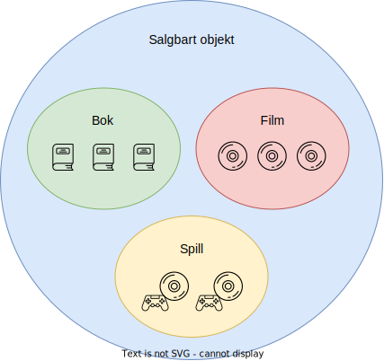
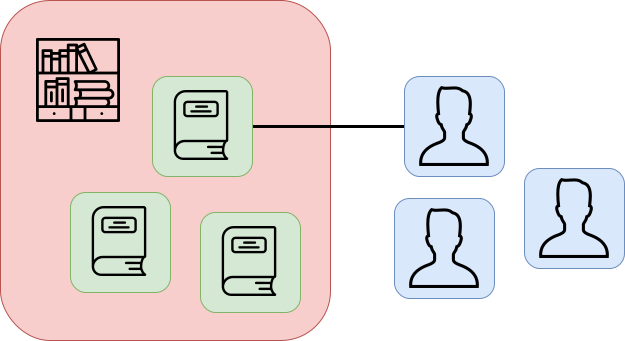
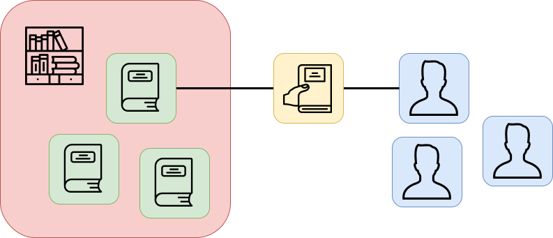

# Hva er objekter?

## Fysiske objekter

For å forstå objekter i programmering, kan vi først tenke på hvordan vi oppfatter virkeligheten. Når vi står på rommet vårt og ser rundt oss, kan vi dele opp synsinntrykket i objekter. De største objektene er kanskje senga, skrivebordet, klesskapet og bokhylla. Vi kunne nå begynt å skrive ned en usortert liste over objekter, men hvis vi vil være mer strukturerte, gjør vi kanskje følgende observasjoner:

- Større objekter kan inneholde mindre objekter - klesskapet inneholder klesplagg, og bokhylla inneholder kanskje bøker, filmer og spill. 
- Boka *Sofies verden*, filmen *Flåklypa Grand Prix* og spillet *The Last of Us* er tre konkrete objekter. Vi kan tenke at disse objektene er i hver sin kategori, nemlig kategoriene "Bok", "Film" og "Spill". 
- Men vi kan også definere større kategorier som inneholder både bøker, filmer og spill. Vi gjør dette ved å tenke over hvilke egenskaper objektene har til felles:
	- Både bøkene, filmene og spillene ligger i hylla, så den større kategorien kan hete "Hylleobjekt". 
	- Både bøkene, filmene og spillene kan selges på en plattform for brukte gjenstander, så den større kategorien kan hete "Salgbart objekt". 

Følgende figur viser eksempler på objekter plassert i kategorier:

I virkeligheten finnes altså slike hierarkier av objekter og kategorier, og i senere artikler skal vi se hvordan vi utnytter dette i programmering. Dette er svært spennende, men først lurer du kanksje på hva objekter har å gjøre med programmering? Vi skal forklare dette med utgangspunkt i et praktisk eksempel, som vi skal følge i flere artikler framover. 

## Modellering med objekter

Se for deg at du har en stor boksamling, og du liker å anbefale og låne bort bøker til familie og venner. Du ønsker nå å lage et program som kan hjelpe deg. Programmet skal holde oversikt over bøkene i samlingen og registrere utlån til personer. Du ser for deg at programmet også kan gjøre mer komplekse ting, som å hente informasjon om bøkene på internett, gjøre søk etter ledige bøker, og kanskje til og med gi anbefalinger basert på interesser. Det vi har skrevet her er en *kravspesifikasjon* - en beskrivelse av ønskede funksjoner til programmet. Den kan være kort som her, eller mer detaljert. 

Vi har altså en kravspesifikasjon for et boksystem. Siden dette bare er tekst, bør vi strukturere informasjonen før vi begynner å programmere. Det første vi bør spørre oss, er hvilke objekter som finnes i kravspesifikasjonen. I dette tilfellet er hovedobjektene bøker og personer. Vi kan nå lage et enkelt diagram:

Vi har tegnet tre bokobjekter og tre personobjekter, for å vise at det finnes flere av hver type. Vi har også tegnet en kobling som viser at en person kan låne en bok.  Dette er en modell, altså en forenkling av virkeligheten. Her ønsker vi kun å vise hvilke objekter som er relevante og hva som er relasjonen mellom dem. 

Hvordan vet vi hvilke objekter som er relevante? Her finnes det ikke et entydig svar, og det er ofte flere gode måter å modellere en situasjon. Men som en generell regel, så identifiserer vi de objektene som har relevante egenskaper og handlinger. Egenskaper gir informasjon om objektet, og handlinger er ting vi kan gjøre med objektet. Nå kan vi begrunne at bøker og personer er relevante objekter for programmet vårt:

- En bok har egenskaper, for eksempel tittel, forfatter og status (utlånt eller ledig).
- Man kan gjøre handlinger med en bok, for eksempel “Lån ut” og “Levér inn”. 
- En person har egenskaper, for eksempel navn og interesser. 
- Man kan gjøre handlinger med en person, for eksempel “Anbefal bok”.

Alle disse egenskapene og handlingene er relevante for boksystemet vårt.

## Ikke-fysiske objekter

Vi kan vurdere å inkludere andre objekter i modellen over vår boksamling. Kanskje vil vi at programmet skal holde orden på bokhyller, for å hjelpe oss å finne igjen og organisere bøker. Da er en bokhylle et relevant objekt:

- En bokhylle har egenskaper, nemlig hvilke bøker og bokkategorier den inneholder, samt kapasitet. 
- En bokhylle har handlinger,  for eksempel “Legg til bok”, “Fjern bok” og “Vis boktitler”. 

Vi kan nå utvide modellen (det røde objektet er en bokhylle): 

Er dette alle relevante objekter? Hvis vi kun vurderer fysiske objekter, er svaret kanskje ja. Men når vi programmerer, trenger ikke objektene å være fysiske ting. For eksempel, når vi låner en bok på biblioteket, blir det registrert et utlån. Et utlån er ikke noe vi kan ta og føle på, men det er likevel et relevant objekt: 

- Et utlån har egenskaper, nemlig hvilken bok og person det gjelder, samt startdato og frist for innlevering. 
- Et utlån har handlinger, for eksempel “Forleng lånetid”.

Hvis vi legger til utlån i modellen, får vi følgende diagram (det gule objektet er et utlån):

Koblingene viser at et utlån knyttes til en person og en bok. 

Har vi nå inkludert alle relevante objekter? For å svare på det, bør vi gå tilbake til kravspesifikasjonen, og sjekke om vi mangler noen handlinger. Vi ønsket jo for eksempel å søke etter ledige bøker. Hvilket objekt gjøres denne handlingen på? På hele boksamlingen! Dette er et relevant objekt: 

- En boksamling har en egenskap, nemlig hvilke bokhyller og bøker den inneholder. 
- En boksamling har handlinger, for eksempel “Søk etter ledig bok” eller “Vis ledige bøker”. 

Hvis vi legger til dette objektet, får vi følgende diagram (det oransje objektet er en boksamling): 

Som vist i diagrammet, kan en boksamling godt inneholde flere bokhyller. 

## Oppsumering 

* En kravspesifikasjon er en beskrivelse av ønskede funksjoner til et program.
* Fra en kravspesifikasjon kan vi lage en modell av de relevante objektene, og vise relasjoner mellom dem. 
* Vi tar med de objektene som har relevante egenskaper og handlinger.
* Objekter kan være både fysiske og ikke-fysiske.

## Oppgaver

**Oppgave A.** Se rundt deg og skriv ned noen objekter. Forsøk å organisere objektene i hierarkier. Er noen objekter inneholdt i andre? Hvilke kategorier finnes? Tenk over om objekter i ulike kategorier har ting til felles, og bruk dette til å lage større kategorier. Gi meningsfulle navn til de større kategoriene. 

**Oppgave B.** Tenk deg at du skal starte opp en butikk. Velg selv hvilke varer og/eller tjenester du vil tilby. Du ønsker nå et program for å holde oversikt over varebeholdning, fortjeneste og annet. 

1. Skriv en kravspesifikasjon, altså noen setninger om hvilke funksjoner du ønsker at programmet skal ha. 
2. Tegn de relevante objektene i et diagram. Skill mellom forskjellig typer objekter, og få fram relasjoner mellom objekter (det er ikke så viktig hvordan du gjør det, så lenge det gir mening for deg og du kan forklare diagrammet). 
3. Hvilke egenskaper og handlinger har objektene? 
4. Hvis du mangler noen handlinger fra kravspesifikasjonen, tenk over hvilke objekter handlingene gjøres på, og legg til disse objektene i modellen.

**Oppgave C.** Under følger kravspesifikasjoner for noen etterspurte programmer. Velg de du synes virker mest interessant, og svar på punktene 2-4 fra oppgave A. 

* Et hotell ønsker et program for å håndtere rombestillinger. Programmet skal kunne sjekke om et bestemt rom er ledig en gitt periode og ta imot en rombestilling. Vi ønsker også å kunne vise alle ledige rom en gitt periode. 
* En takeaway-restaurant ønsker et program for å holde oversikt over meny, beholdning av råvarer og bestillinger. Man ønsker å kunne vise tilgjengelige retter (basert på varebeholdning), samt liste over råvarer som eventuelt mangler. Restauranten skal ta imot bestillinger fra klokken tre hver dag, registrere når bestillinger fullføres, og kunne vise en liste over gjenstående bestillinger. 
* Mer kommer. 

## Fasiter

**Oppgave B.** Matbutikk som eksempel. 

