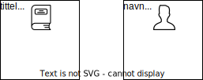

# Hva er en klasse?

## Datafelter og verdier

I forrige kapittel begynte vi å planlegge et ønsket boksystem. Bøker og personer var objektene i den enkleste modellen. Vi kan fylle inn eksempeldata i modellen, for å vise hvilke egenskaper vi ønsker å ta med: 

Merk at vi fyller inn verdier på samme måte i alle bøker. Dette gjør det lett å se at objektene er av samme type. Hadde vi skrevet sideantallet på en bok, men antall kapitler på en annen bok, ville informasjonen kunne oppfattes som ustrukturert. Vi gjør det strukturert ved å ta utgangspunkt i en *mal*: 

De hvite, rette boksene er maler som vi bruker til å opprette objekter. Når vi oppretter en bok, skal altså tittel, forfatter og sideantall fylles inn. Når vi oppretter en person, skal navn og alder fylles inn. For å skille mellom maler og objekter, bruker vi følgende begreper: 

* I malen har vi *datafelter*. De forteller hva som skal fylles ut når objekter opprettes. "tittel" er et datafelt. 
* I objektene fyller vi inn *verdier* på de ulike datafeltene. Det første bokobjektet har verdien "Sofies verden" på datafeltet "tittel". 

Når vi snakker om objekter generelt, bruker vi altså begrepet datafelter, og når vi snakker om et spesifikt objekt, bruker vi begrepet verdier. 

## Klasser

Vi fokuserer nå på malene for bøker og personer: 

Når vi bruker malene får vi objekter med visse datafelter. Men som nevnt i forrige kapittel skal objektene ikke bare ha datafelter, men også handlinger. For eksempel skal bøker kunne lånes ut og leveres inn. Derfor legger vi til handlinger i malene: 

Her skriver vi handlingene som funksjoner, for å vise at det nettopp er funksjoner vi skal programmere. Mer om det senere - nå skal vi se hva som skjer når vi oppretter objekter fra malene: 

Vi ser at hvert objekt får en kopi av handlingene. Grunnen til det er at når vi skal utføre en handling, må vi først "gå inn" på et spesifikt objekt, og deretter utføre handlingen på det objektet. Å gjøre handlingen `lån_ut()` på det første bokobjektet (*Sofies verden*) kan gi et annet resultat enn på det andre bokobjektet (*Beatles*). Her kan du se hvordan handlinger kan ha ulikt resultat på ulike objekter: 

Nå som vi har inkludert både datafelter og handlinger i malene, har vi klasser! En klasse er nemlig akkurat det - en mal på objekter av samme type, der vi tar med både datafelter og handlinger. Vi skal senere se hvordan man programmerer en klasse, men vi bør alltid skissere klassene i et diagram først. I et slikt diagram bør hver klasse ha et navn med stor forbokstav: 

Vi har altså en Bok-klasse og en Person-klasse, og fra disse kan vi opprette Bok-objekter og Person-objekter. 

Diagrammet ovenfor kalles et *klassediagram*. Mer spesifikt har vi laget en enkel versjon av et *UML-klassediagram*. UML betyr *Unified Modeling Language* og gir regler for hvordan vi skal tegne, slik at alle kan forstå hverandres diagrammer. Man trenger ikke å pugge disse reglene, men lære gjennom eksempler. Ved å følge eksempelet over kan du allerede tegne enkle UML-klassediagrammer, og senere skal vi vise hvordan man legger til mer informasjon.

## Flere klasser i bokeksempelet

I planleggingen av bokprogrammet kom vi fram til følgende modell av objektene: 

Hvilke klasser kommer disse objektene fra? For eksempel har vi to bokhylleobjekter, og i forrige kapittel kom vi fram til relevante datafelter og handlinger for bokhyller. Dette kan vi bruke til å lage en klasse: 

Legg merke til  at handlingene nå har en parameter. Det er fordi vi må vite hvilken bok som eventuelt skal legges til eller fjernes fra hylla. 

Vi kan gjenta denne prosessen og lage et fullstendig klassediagram for boksystemet, med datafelter, handlinger og parametre: 

Vi kan altså opprette objekter fra fem forskjellige klasser. Antagelig kommer vi bare å opprette ett Boksamling-objekt, og mange objekter fra de andre klassene. 

I diagrammet har vi forsøkt å plassere handlingene i klassene de hører hjemme. Hvordan vet vi hvor en handling hører hjemme? Det første spørsmålet vi kan stille er:

1. Hvilket objekt gjøres handlingen på? Hvis vi vil søke etter en bok, må vi søke i hele boksamlingen, og derfor gjøres handlingen på et Boksamling-objekt. 

	Noen ganger har vi ikke et klart svar på spørsmålet over. For eksempel, når vi legger en bok i en bokhylle, gjør vi da en handling med boka eller bokhylla? Begge deler! Så hvorfor plasserte vi handlingen i Bokhylle-klassen? Vi kan stille et annet nyttig spørsmål hvis vi er i tvil:

2. Hvilke datafelter bør vi ha tilgang til når vi gjør handlinger? Når vi legger en bok i en bokhylle, er vi kanskje mest interessert i egenskaper ved hylla, for eksempel om den har  ledig plass, hvilken seksjon av hylla boka kan legges, og så videre.

## Oppsummering

* En klasse er en mal for å lage objekter av samme type. I klassen sier vi hvilke datafelter og handlinger objektene skal ha når de opprettes. 
* Når objekter opprettes, fylles datafeltene med verdier.  
* UML er en standardisert måte for hvordan vi tegner klasser.

## Oppgaver

**Oppgave A.** Ta utgangspunkt i oppgave A fra forrige kapittel. Se på objektene i modellen. Hvilke klasser kommer objektene fra? Tegn et klassediagram etter eksemplene gitt i dette kapittelet. Få med alle relevante egenskaper og handlinger.

**Oppgave B.** Ta utgangspunkt i oppgave B fra forrige kapittel og tegn klassediagram (som i oppgaven over).

## Fasiter

