# Mer om objekter og klasser

## Skrivemåte for objekter

Fra forrige kapittel har vi følgende klassediagram:

Dette er maler som vi bruker til å opprette objekter. Tenk deg at vi vil registrere boken *Sofies verden* i systemet. Vi må da opprette et `Bok`-objekt. En vanlig måte å skrive et slikt objekt på er:

`Bok("Sofies verden")` 

Først sier vi hvilken klasse objektet kommer fra, deretter skriver vi verdien til de viktigste datafeltene i parenteser (vi kunne også skrevet `Bok("Sofies verden", "Jostein Gaarder")` for å unngå sammenblanding av bøker med samme titel). 

To andre `Bok`-objekter er:

`Bok("Beatles")`    
`Bok("Når villdyret våkner")`   

Tilsvarende kan vi opprette tre `Person`-objekter: 

`Person("Per Hansen")`   
`Person("Hilde Bakken")`   
`Person("Siv Larsen")`  

## Datafelter, metoder og meldinger

I de ulike klassene har vi definert datafelter og handlinger: 

Merk at datafeltene kommer øverst, og deretter handlingene, og at vi skiller dem med en linje. 

Handlinger, altså ting vi kan gjøre med objekter, kalles vanligvis *metoder*. Vi kan si følgende om `Bok`-klassen: 

- Klassen har datafeltene `tittel`, `forfatter`og `sideantall`, og metodene `lån_ut()` og `lever_inn()`. 
- Vi kan bruke klassen til å opprette `Bok`-objekter. Hvert objekt får datafeltene og metodene som er definert i klassen. Deretter kan datafeltene fylles med verdier, og metodene behandler disse verdiene. 

Vi kan be et objekt om å utføre en av sine metoder. Det kalles å *sende en melding* til objektet.

- Hvis vi vil registrere innlevering av boka *Sofies verden*, må vi sende en melding til objektet`Bok("Sofies verden")`. Mer spesifikt må vi be objektet om å utføre metoden `lever_inn()`. 
- Hvis vi ønsker at Per Hansen skal få en anbefaling, må vi sende en melding til objektet `Person("Per Hansen")`. Mer spesifikt må vi be objektet om å utføre metoden `få_anbefaling()`.

## Datatyper

Når vi skriver tekststrengen`"Sofies verden"` i Python, så opprettes et objekt fra klassen `str`.  Dette er en innebygd klasse i Python - den har datafelter og metoder, akkurat som klassene vi lager selv. 

*Vi kan for eksempel be objektet `"Sofies verden"` om å utføre metoden `capitalize()` for å endre tekststrengen til `"SOFIES VERDEN"`. Hvis du er interessert i hvilke andre metoder `str`-klassen har, så kan du se [her](https://docs.python.org/3/library/stdtypes.html#string-methods)*. 

Tilsvarende, når vi skriver tallet `512` i Python, så opprettes et objekt fra klassen `int`. 

I Python sier vi at *datatypen* til et objekt er det samme som klassen det er laget fra. Vi sier altså at: 

* `"Sofies verden"`er et objekt av datatypen `str`.
* `512`er et objekt av datatypen `int`.
* `Bok("Sofies verden")` er et objekt av datatypen `Bok`. 

I klassediagrammet kan vi skrive hvilke datatyper de ulike datafeltene skal ha:

 

Datafeltene  må selvfølgelig ikke ha datatypen `str` eller `int` - du kan bruke dine egne datatyper! For eksempel bør et `Bok`-objekt ha informasjon om lånestatus. Vi kan gjøre dette ved å legge til datafeltet `aktivt_utlån`: 

Dette datafeltet har altså datatypen `Utlån`.  Det betyr at når et utlån registreres, skal `aktivt_utlån` fylles med et `Utlån`-objekt, der vi finner informasjon om utlånet, slik som lånetaker, startdato og leveringsfrist. 

I tillegg ønsker vi  å lagre lånehistorikken til en bok. Da kan vi legge til et datafelt som heter `lånehistorikk`: 

Hvilken datatype skal dette datafeltet ha? Det vi ønsker er altså å ta vare på alle `Utlån`-objekter som har blitt opprettet for boka. Disse kan lagres i en liste! I Python har du kanskje laget lister av tall eller tekstrenger, for eksempel:

`["Per Hansen", "Hilde Bakken", "Siv Larsen" ]`    
`[70, 63, 47]`

Hva er datatypen til disse listene? Når vi oppretter en liste i `Python`, bruker vi den innebygde klassen `list`. Derfor kan vi si at `[70, 63, 47]` er et objekt av datatypen `list`! Hvis vi vil presisere at listen inneholder `int`-objekter, kan vi si at datatypen er `list[int]`. Her er et eksempel på et objekt av typen `list[Bok]`: 

`[Bok("Beatles"), Bok("Når villdyret våkner")]`

Vi ønsker altså at datafeltet `lånehistorikk` skal lagre tidligere utlån. Nå vet vi hvilken datatype vi trenger, nemlig `list[Utlån]`! Vi kan legge til dette i klassediagrammet:  

Vi kan også vise datatypen til parametre og returverdier: 

Her sier vi at parameteren `person` skal ha datatypen `Person`, og at returverdien skal ha datatypen  `bool`. Altså er returverdien enten `True` eller `False` (dette kan fortelle om utlånet/innleveringen ble godkjent eller ikke). 

## Objektdiagram og pekere

Vi skal nå vise en alternativ måte å visualisere objekter. Som eksempel lager vi et objekt fra hver av klassene `Bok`, `Utlån` og `Person`:

Den nederste delen av figuren kalles et objektdiagram, og er tegnet på følgende måte: 

- Det første objektet har overskriften `bok1: Bok`. Dette betyr at variabelen med navn `bok1` holder på objektet, og at datatypen til objektet er `Bok`. Det er lov å bare oppgi datatypen, som vist i det andre objektet. 
	+ Når et program kjøres, kan variabelen `bok1` holde på `Bok("Sofies verden")` på et tidspunkt, men senere holde på et helt annet objekt. Diagrammet viser altså hva variablene inneholder på et *spesifikt tidspunkt* under kjøringen av programmet. 
- Vi tegner bokser for objektets verdier. Det første objektet har verdien `"Sofies verden"` på datafeltet `tittel`. Det er lov for et objekt å mangle noen verdier, og dette vises med en tom boks. 

Tenk deg at Per Hansen nettopp har lånt boka *Sofies verden*. Hvordan registrerer vi dette i systemet? Det er tre ting vi ønsker å gjøre: 

1. Opprette et `Utlån`-objekt som inneholder informasjon om utlånet. 
2. Registrere utlånet i objektet `Person("Per Hansen")`. 
3. Registrere utlånet i objektet `Bok("Sofies verden")` 

I diagrammet ovenfor har vi gjennomført det første steget, nemlig å opprette et `Utlån`-objekt, men foreløpig har objektet ingen verdier. Hvilken verdi skal fylles inn på datafeltet `bok`? For å spørre på en annen måte, hva ønsker du å få tilbake når du henter denne verdien senere? Det hadde ikke vært så nyttig å bare få tittelen `"Sofies verden"`! Det du antagelig ønsker å få tilbake er objektet `Bok("Sofies verden")` (til venstre i diagrammet). Hvordan får vi tak i dette objektet?

Et sted i datamaskinens minne ligger objektet `Bok("Sofies verden")`. For å kunne gjøre operasjoner på objektet, må vi fortelle datamaskinen hvor i minnet det ligger.  Hver gang vi oppretter et objekt, får vi tildelt en *minneadresse*, som gjør at vi kan finne igjen obkjektet senere. Vi trenger selvfølgelig ikke å huske denne adressen når vi koder - faktisk er det slik at når vi legger objektet i en variabel, så er det minneadressen som lagres i variabelen! Hensikten med variabler er altså å ta vare på minneadresser for oss, slik at vi kan finne igjen objektene som vi skal gjøre operasjoner på!
 
Spørsmålet var altså hva vi skal sette inn i datafeltet `bok` på `Utlån`-objektet. Nå vet vi svaret - vi skal sette inn minneadressen til objektet `Bok("Sofies verden")`. Dette vises med en pil: 

Nå blir det ikke riktig å si at`Utlån`-objektet "inneholder" `Bok`-objektet. Vi sier heller at `Utlån`-objektet har en *peker* til `Bok`-objektet. Slik fungerer det alltid - vi setter aldri et objekt inn i et annet objekt, men bruker pekere slik at objekter kan finne hverandre. Nå kan vi sørge for at både`Bok`-objektet og `Person`-objektet kan finne utlånet de er en del av: 

 

Kan du se hvilken peker som mangler i diagrammet ovenfor? 

## Oppdeling av metoder

Vi bør navnsette metoder slik at det er lett å skjønne hva de gjør. For å registrere at en bok leveres inn, er altså `lever_inn()` et fornuftig valg av navn:
* Navnet starter med et verb som beskriver handlingen. 
* Det er unødvendig å bruke navnet`lever_inn_bok()`, fordi metoden er i `Bok`-klassen, så vi vet allerede at den bare brukes på `Bok`-objekter.  

Et viktig prinsipp er at **en metode bør kun ha én oppgave**. Dette må vi tenke på når vi skal legge til ny funksjonalitet i bokprogrammet vårt. Kanskje det skal være mulig å skrive en anmeldelse samtidig som man leverer en bok? Da bør vi dele opp denne prosessen i to metoder: 

- `lever_inn()` for å levere boka.
- `legg_til_anmeldelse(person, tekst)` for å legge til en anmeldelse av boka.

Det er kanskje fristende å legge begge handlingene i en metode, for det er jo bare lånetakeren som skal kunne skrive en anmeldelse av boka? Men dette problemet bør vi løse på en annen måte, for eksempel med en betingelse (`if`-setning) i anmeldelse-metoden. Det viktigste er å følge prinsippet om én oppgave per metode. 

For å se på et mer interessant eksempel, skal vi begynne å tenke på hvordan vi kan rangere bøker. Vi legger til et datafelt og metode i klassediagrammet, markert i grønt: 

Metoden `regn_ut_gjennomsnittsvurdering()` skal gi boka en poengsum basert på anmeldelser fra ulike kilder. Merk at navnet inneholder kun ett verb, som er et godt tegn på at vi følger prinsippet om én oppgave. Men hva om metoden trenger flere steg for å komme fram til svaret? For eksempel kan den gjøre følgende steg:

1. Regne ut gjennomsnittet av lånetakernes vurderinger.
2. Regne ut gjennomsnittet av brukervurderinger på nett, fra sider som [*Bokelskere*](https://bokelskere.no/) og [*Goodreads*](https://www.goodreads.com/). 
3. Hvis boken er utgitt etter 2010; regne ut gjennomsnittet av litteraturanmeldelser på nett (nettaviser).
4. Regne ut et endelig gjennomsnitt basert på tallene i punkt 1-3. 

Metoden`regn_ut_gjennomsnittsvurdering()` skal kun ha én oppgave, nemlig å gjøre utregningen i det fjerde punktet. Men de tre første stegene må utføres først, så hvordan håndterer vi denne situasjonen?  Løsningen er å delegere de tre prosessene til andre metoder:

1. `regn_ut_gjennomsnitt(anmeldelser)`
2. `hent_brukeranmeldelser_på_nett()`, deretter bruke metoden fra punkt 1 til å finne gjennomsnittet av anmeldelsene vi har hentet.
3. `hent_litteraturanmeldelser_på_nett()`, deretter bruke metoden fra punkt 1.

Vi legger til disse metodene i klassediagrammet: 

Metodene vi har lagt til kalles gjerne *delmetoder*, fordi de utfører delprosesser, og sørger for at`regn_ut_gjennomsnittsvurdering()` kun tar seg av selve utregningen. Fordelen med denne oppdelingen er at det blir enklere å modifisere og utvide programmet senere:

- Koden blir lettere å lese. Uten delmetoder ville koden til `regn_ut_gjennomsnittsvurdering()` antagelig blitt svært lang og vanskelig å få oversikt over. Ved å bruke delmetoder med gode navn, skjønner man på kort tid hvilke fire hovedsteg som utføres. Lesbar kode er svært viktig dersom vi ønsker å jobbe videre med programmet senere, og enda viktigere dersom vi ønsker at andre skal kunne utvide eller benytte deler av programmet. 
- Når vi skal gjøre en endring i et program, bør det alltid være lett å finne de riktige kodelinjene! Dersom vi har metoder som utfører mange forskjellige oppgaver, kan det til slutt bli umulig å vite hvilke kodelinjer vi må endre for å oppnå en bestemt funksjonalitet. Men ved å følge prinsippet om én oppgave, vet vi alltid hvilke metoder vi skal gå til. Tenk deg for eksempel at du ønsker å gjøre følgende endringer:
	- Du kommer fram til at brukeranmeldelser på nett bør telle mest, og ønsker derfor å endre vektingen av de ulike kildene. Dette er en endring av utregningen, og det er `regn_ut_gjennomsnittsvurdering()` som har denne oppdaven. 
	- Du ønsker å inkludere anmeldelser fra flere nettsider. Denne oppgaven ligger hos metoden `hent_brukeranmeldelser_på_nett()`. 
- Vi kan gjenbruke delmetodene til andre formål. For eksempel, å hente en oppdatert liste med nettanmeldelser kan være nyttig i andre deler av boksystemet vårt. Senere ønsker vi kanskje å presentere anmeldelsene, eller søke etter stikkord i anmeldelsene for å gi bedre bokanbefalinger. 

## Flytdiagram

Metoden `regn_ut_gjennomsnittsvurdering()` fra forrige seksjon utfører flere steg for å regne ut en gjennomsnittsvurdering av en bok. Vi kan vise disse stegene i et *flytdiagram*: 

Dette ser kanskje komplisert ut, men man trenger ikke å vite mye for å forstå et slikt diagram. Vi begynner med å forklare de ulike blokkene:

1. I den grønne delen finner vi gjennomsnittet av lånetakernes vurderinger.
2. I den blå delen finner vi gjennomsnittet av brukervurderinger på nett.
3. I den lilla delen finner vi gjennomsnittet fra litteraturanmeldelser på nett.
4. I den røde delen regner vi ut det endelige gjennomsnittet.

Slik fargelegging er ikke nødvendig, men gjør det lettere å forstå helheten. Merk også hvordan vi kan plassere boksene slik at diagrammet blir mer oversiktlig.  

I vårt eksempel har vi fire typer bokser: 

- **Sirkel/ellipse** markerer start og slutt på metoden.
- **Rektangel** er en operasjon, for eksempel en metode.
- **Paralllellogram** er data. I vårt eksempel kommer disse før og etter metoder, for å vise inndata og utdata til metodene. 
- **Diamant** er et valg. Basert på valget bestemmes videre rute i flytdiagrammet. 
	- I vårt flytdiagram har vi én valgboks. Merk at den lilla delen av flytdiagrammet bare utføres hvis vi svarer "Ja" på valgboksen. 
	- Vi kan velge selv hva som skal være alternativene i en valgboks. Det må ikke være "Ja" og "Nei", og det kan være flere enn to alternativer.

## Kommunikasjon mellom objekter

Objekter kan sende meldinger til hverandre. Det vil si at et objekt kan be et annet objekt om å utføre en av sine metoder. Som eksempel skal vi definere en metode som rangerer bøkene. I hvilken klasse bør denne metoden være? Siden vi gjør noe med alle bøkene, altså hele boksamlingen, bør vi legge metoden i `Boksamling`-klassen.

Vi tar nå utgangspunkt i følgende klassediagram, der relevante datafelter og metoder er skrevet i grønt:

Det er altså metoden`vis_rangert_liste()` som skal rangere bøkene. Hvilke steg trenger metoden? Først må hver bok ha en poengsum, og deretter kan vi sortere bøkene etter poeng. Stegene er altså:

1. Regne ut poengsummen til hver bok i listen `bøker`. Vi gjør dette ved å sende meldingen`regn_ut_gjennomsnittsvurdering()` til hvert `Bok`-objekt. Vi lagrer tallene vi får tilbake. 
2. Sortere listen `bøker` basert på tallene vi fant i punkt 1. 
3. Vise den sorterte listen. 

For at dette skal fungere, må `Bok`-objektene tilby metoden `regn_ut_gjennomsnittsvurdering()` til andre objekter. Hva betyr det?   Av alle metodene som finnes i et`Bok`-objekt, så er noen *offentlige* og andre er *private*. Hva er forskjellen? 

* Alle objekter kan be om at `Bok`-objektet utfører en av sine offentlige metoder.
* Ingen andre objekter kan be om at `Bok`-objektet utfører en av sine private metoder, ikke engang andre `Bok`-objekter. En privat metode kan kun brukes som byggeblokk til andre metoder i det samme objektet, altså som en delmetode. 

Vi bruker klassen, det vil si malen på en bok, til å definere hvilke metoder som skal være offentlige og private. La oss se hvordan vi kan definere at alle metoder skal være private: 

Vi skriver altså et minustegn foran metodenavnet for å vise at den er privat. Nå skal vi gjøre noen av metodene offentlige. Vi ønsker for eksempel å tilby metodene for utlån og innlevering til andre objekter. Og for å kunne rangere bøker, må metoden `regn_ut_gjennomsnittsvurdering()` også være offentlig. For å gjøre en metode offentlig, endrer vi minustegnet til et plusstegn:

Nå lurer du kanskje på hva som er poenget med private metoder? Hvorfor ikke bare gjøre alle metoder offentlige? Vi tar utgangspunkt i eksempelet over, der vi har et`Boksamling`-objekt og flere `Bok`-objekter. Vi later som vi er `Boksamling`-objektet. Vi inneholder altså en metode for å rangere bøker, og vi gjør det ved å sende meldinger til `Bok`-objekter og få svar tilbake. Vi aner ikke hvilke prosesser som skjer inni `Bok`-objektene, men vi stoler på at de alltid svarer oss på den måten vi forventer. 

Vi kan selvfølgelig godta at noen `Bok`-objekter ikke klarer å finne anmeldelser (for eksempel hvis boka er ganske ukjent). Men vi må alltid få et svar som vi kan tolke. Det kan for eksempel fungere på følgende måte: 

* Hvis svaret er et tall mellom 0 og 10, så har `Bok`-objektet funnet anmeldelser og regnet ut en vurdering. 
* Hvis svaret er -1, betyr det at `Bok`-objektet ikke har funnet noen anmeldelser. 
 
En slik løsning kan vi være fornøyde med. Uansett hvor dårlig `Bok`-objektene er til å finne anmeldelser, så blir vi i hvert fall aldri overrasket - vi vet hvilke svar vi kan få, og hvordan de skal tolkes. Men hvis `Bok`-objektene på et senere tidspunkt slutter å gi svar eller gir feil svar, så har vi grunn til å være skuffet! Da vil hele rangeringsfunksjonen vår slutte å fungere. 

Hva kan vi lære av dette tankeeksperimentet? Når vi tilbyr en metode til andre objekter, må vi forplikte oss til følgende: 

* At vi aldri endrer navnet eller parameterne til metoden. 
* At metoden gir svar i alle tilfeller, selv når den ikke fungerer slik vi ønsker. Vi bør gi en god beskrivelse av hva de ulike svarene betyr.
* At metoden for all fremtid gir et av de forventede svarene. 

Hvis vi bryter ett av disse punktene, kan vi ødelegge kommunikasjonen mellom mange objekter! Som en generell regel bør vi starte med å gjøre alle metoder private, og først når det oppstår behov for å tilby en metode, kan vi gjøre den offentlig. Da må vi huske å følge kravene listet ovenfor, som kort sagt sier at en offentlig metode må være stabil for all fremtid. 

*Grensesnittet* til et objekt er listen av datafeltene og metodene som er offentlige. Altså er grensesnittet til `Bok`-objekter følgende: 

For å skjønne hvorfor vi bruker ordet "grensesnitt", kan vi tenke på objekter som avgrensede områder. Inni objektet har vi alle de private metodene, mens langs grensen har vi de offentlige metodene. Det er altså langs grensen objektet tilbyr sin funksjonalitet til omverdenen:

Kommunikasjonen mellom objekter er vist med grønn pil, mens kommunikasjon innad i et objekt er vist med røde piler. Merk hvordan `Bok`-objektet bruker delmetoder til å bygge opp en offentlig metode, som deretter brukes til å rangere bøker i `Boksamling`-objektet.

De indre metodene er private, og vi kan endre og slette dem etter behov. Men metodene i grensesnittet må holdes stabilt, slik at kommunikasjonen på tvers av objekter alltid fungerer.

I denne seksjonen har vi snakket om objekter, men vi bør huske at grensesnittet er noe vi bestemmer når vi lager klasser. Vi kan derfor si at klassen `Bok` har et grensesnitt, og at alle`Bok`-objekter får dette grensesnittet. 

## Konstruktører

Når vi sier at vi "oppretter objekter fra en klasse", kan vi se for oss følgende diagram:

Men hvordan oppretter vi egentlig objekter når vi skriver kode? Svaret er at  alle klasser må ha en spesiell metode for å opprette objekter, som kalles en *konstruktør* (fordi den "konstruerer" objekter). 

Hvordan legger vi til en konstruktør i klassen? Vi definerer en metode med samme navn som klassen, og med noen ønskede parametre. En konstruktør for `Bok`-klassen kan derfor være `Bok(tittel, forfatter, antall_sider)`. Følgende figur viser hvordan vi bruker konstruktøren til å opprette objekter: 

En konstruktør uten kode vil bare opprette et tomt objekt. Hvis vi ønsker gjøre operasjoner på det nyopprettede objektet, må vi skrive kode i konstruktøren, akkurat som i andre metoder. I eksempelet over gjør konstruktøren følgende operasjon med det nye objektet: 

* Fyller datafeltene `tittel`, `forfatter` og `antall_sider` med verdiene som ble gitt i parametrene. 

Denne operasjonen skjer altså ikke automatisk - vi må skrive kode som "flytter" parametrene til datafeltene. Å fylle datafeltene med verdier er hovedoppgaven til en konstruktør. Det er tross alt ikke så interessant å opprette masse tomme objekter, for vi ønsker jo at de nye objektene skal representere spesifikke bøker. Det kan godt hende at konstruktøren gjør mer komplekse ting, som i følgende eksempel: 

Her har vi definert en annen konstruktør, med ISBN som parameter (alle utgitte bøker har et unikt nummer kalt ISBN). Merk at objektene blir fylt med riktige verdier. Det betyr at konstruktøren gjør følgende operasjoner: 

1. Bruker ISBN-nummeret til å hente informasjon om boka, for eksempel fra en nettdatabase. 
2. Fyller datafeltene `tittel`, `forfatter` og `antall_sider` med verdiene som ble funnet i forrige punkt. 

Igjen bør det nevnes at konstruktørens hovedoppgave er den andre operasjonen. For å følge prinsippet om én oppgave, bør vi derfor delegere den første operasjonen til en annen metode, som for eksempel kan hete`hent_informasjon(isbn)`.

I programmeringsspråket Java kunne vi inkludert begge konstruktørene vi har definert. Klassediagrammet blir da:

Her har vi altså to forskjellige måter å opprette `Bok`-objekter på. Det ser kanskje rart ut å ha to metoder med samme navn, men siden de har forskjellige antall parametre,  regnes de som forskjellige metoder i Java. 

Dette fungerer derimot ikke i Python. Hvis vi definerer to metoder med samme navn, så vil Python regne den siste metoden som den mest oppdaterte versjonen, og den første metoden vil overskrives. Det betyr at vi bare kan ha én konstruktør i Python. Men som vi skal vise i implementasjonsdelen, kan vi sørge for at den ene konstruktøren kan brukes på forskjellige måter, slik at vi oppnår funksjonaliteten som er gitt i klassediagrammet over. 

## Grensesnitt og dokumentasjon

Tenk deg at du har programmert alle klassene i boksystemet, og ett år senere skal du lage en nettside for rangering av bøker. Du husker at du var fornøyd med  `Bok`-klassen, og vil bygge det nye programmet rundt denne klassen.

Du finner igjen`Bok`-klassen i en programfil kalt *Bok.py*, og kopierer denne fila over til den nye prosjektmappa. Hva nå? Du har selvfølgelig glemt all koden, og det vil ta deg en god stund å forstå den. Men for å ta i bruk en klasse trenger du ikke forstå koden, bare å forstå grensesnittet til klassen! Alt vi trenger å vite er hvordan vi skal bruke de offentlig metodene som er relevante for oss. Mer spesifikt bør vi vite: 

* *Signaturen* til metoden, det vil si navnet og parametrene til metoden
* En beskrivelse av handlingen som utføres av metoden
* En beskrivelse av hver parameter, altså hva slags verdier metoden forventer å motta
* En beskrivelse av returverdien

En slik beskrivelse av hver metode kalles en *dokumentasjon* av klassen. Når vi programmerer `Bok`-klassen, bør vi altså skrive en slik dokumentasjon, slik at det blir lett å gjenbruke klassen senere. 

Følgende klassediagram viser grensesnittet til klassen `Bok`: 

Vi skal nå skrive en dokumentasjon for klassen, ved å følge punktene ovenfor. Merk at konstruktører alltid er offentlige metoder, og at de bør komme først i dokumentasjonen. Dette gir mening, for når vi skal ta i bruk en klasse, så er ofte det første vi vil gjøre å opprette objekter. 

**Dokumentasjon av `Bok`-klassen:**

____

#### `Bok(tittel, forfatter, antall_sider)`

**Beskrivelse:** Oppretter et nytt `Bok`-objekt fra innskrevne verdier. 

**Parametre:**

* `tittel` (`str`): Den fulle tittelen på boka.
* `forfatter` (`str`): Det fulle navnet til forfatteren, skrevet på formen "Fornavn Etternavn".
* `antall_sider` (`int`): Antall sider i boka. 

___

#### `Bok(isbn)`

**Beskrivelse:** Oppretter et nytt `Bok`-objekt fra ISBN. Informasjon om boka hentes ved å gjøre ISBN-søk i bokdatabaser på nett. Hvis denne informasjonen ikke blir funnet, opprettes et tomt `Bok`-objekt. 

**Parametre:**

* isbn (str): Bokas ISBN. 

___

#### `lån_ut(person)`

**Beskrivelse:** Registrerer utlån av boka hvis den er ledig. 

**Parametre:** 

* `person` (`Person`): Personen som skal registreres som lånetaker. 

**Returverdi (`bool`):** `True` dersom utlånet blir godkjent, `False` dersom boka ikke er ledig. 

___

#### `lever_inn()`

**Beskrivelse:** Registrerer innlevering av boka hvis den er utlånt.

**Returverdi (`bool`):**  `True` dersom innleveringen blir godkjent, `False` dersom boka ikke kan leveres inn (fordi boka ikke er registrert som utlånt). 

___

#### `regn_ut_gjennomsnittsvurdering()`

**Beskrivelse:** Returnerer en vurdering av boka, basert på anmeldelser fra følgende kilder: 

* Anmeldelser fra lånetakere
* Brukeranmeldelser på nett
	* Bokelskere
	* Goodreads
* Litteraturanmeldelser på nett

**Returverdi (float):** 

* Dersom minst én anmeldelse blir funnet, returneres et gjennomsnittsverdi på en skala fra 0 til 10, der 10 er høyeste vurdering. 
* Dersom ingen anmeldelser blir funnet, returneres -1.  

____

Nå har vi fullført dokumantasjonen. Vi gjentar at dokumentasjonen må inneholde følgende for hver metode: 

1. Signaturen til metoden
2. Beskrivelse av hva metoden gjør
3. Parameterliste (dersom metoden har parametre)
4. Returverdi (dersom metoden har returverdi)
	
Merk også følgende detaljer:

* Når vi lister parametre og returverdi, skriver vi også datatypen til disse i parantes. 

* En offentlig metode må alltid gi et resultat, og vi må beskrive alle de mulige returverdiene i dokumentasjonen. For eksempel har metoden`regn_ut_gjennomsnittsvurdering()`ett viktig spesialtilfelle, nemlig at ingen anmeldelser blir funnet, og da returneres -1. 

## Oppdeling av klasser

Vi har tidligere sett at en metode kun bør ha én oppgave, og at vi kan oppnå dette ved å dele opp metoder. Det finnes en tilsvarende regel for klasser. En klasse kan selvfølgelig ikke bare ha én oppgave, men den bør kun ha **ett ansvar**. Det betyr at `Bok`-klassen bare skal ha ansvar for datafelter og metoder som har å gjøre med en bok. La oss se på følgende klassediagram: 

Her har vi markert noen av  datafeltene og metodene i grønn skrift. Hva har disse til felles? Det er ikke feil å si at disse har å gjøre med en bok, men kan vi være enda mer spesifikke? Ja, vi kan si at de har å gjøre med *anmeldelser av en bok*. `Bok`-klassen har altså to ansvar - både for selve boka, og for anmeldelser av boka. 

Vi kan også se dette i et spesifikt `Bok`-objekt:

Vi har igjen markert datafeltene som har med anmeldelser å gjøre. Vi kan trekke disse ut av `Bok`-objektet og legge dem i ett nytt objekt:

Det nye objektet har altså ansvar for anmeldelsene til boken *Sofies verden*. Begge objektene har altså å gjøre med boka *Sofies verden* - det første objektet håndterer generelle datafelter og metoder knyttet til boka, mens det andre objektet håndterer anmeldelser av boka. Derfor er det viktig å  koble objektene sammen med pekere begge veier, slik at de kan finne hverandre. 

Du har kanskje merket at det nye objektet har fått datatypen `Bokanmeldelser`. Objektet kommer altså fra en klasse vi ikke har definert enda. Vi definerer den nye klassen ved å ta utgangspunkt i `Bok`-klassen, og trekke ut alt som har med anmeldelser å gjøre: 

Nå ser vi at `Bok`-klassen kun har ansvar for selve boka. Vi har ikke mistet noe funksjonalitet knyttet til anmeldelser, men delegert dette ansvaret til en ny klasse!

Den nye klassen `Bokanmeldelser` skiller seg fra andre klasser vi har sett til nå, fordi den er avhengig av den opprinnelige klassen `Bok`. Det gir nemlig ikke mening å opprette et `Bokanmeldelser`-objekt uten å spesifisere hvilket `Bok`-objekt det tilhører. Vi kan vise denne avhengigheten i klassediagrammet: 

Vi leser dette klassediagrammet på følgende måte:

* Ett `Bok`-objekt har null eller ett  `Bokanmeldelser`-objekt. 

For å oppsummere, så har vi delt opp `Bok`-klassen fordi vi ønsker at hver klasse skal ha sitt spesifikke ansvar. Å følge prinsippet om ett ansvar for klasser har de samme fordelene som for metoder, nemlig at det blir lettere å modifisere og utvide programmet. 

- Egenskaper og metoder fordeles over flere klasser på en naturlig måte. Koden blir dermed bedre strukturert og lettere å lese. 
- Når vi senere vil endre noe som har med innhenting og prosessering av anmeldelser, kan vi jobbe med en klasse som har dette spesifikke ansvaret, uten å bli forstyrret av alt annet som har å gjøre med bøker. 
- Vi kan gjenbruke den nye klassen `Bokanmeldelser` i andre programmer. Hvis vi for eksempel skal lage en nettside som rangerer bøker, så ønsker vi kanskje ikke å bruke hele `Bok`-klassen (vi trenger ikke et system for utlån av bøker), men det er veldig aktuelt å gjenbruke måten vi håndterer bokanmeldelser. 

## Oppsummering

* I objektorientert programmering brukes ofte begrepet *metode* i stedet for *funksjon*, og *melding* i stedet for *funksjonskall*. Å sende en melding til et objekt er å be objektet om å utføre en av sine metoder. 
* Datatypen til et objekt er det samme som navnet til klassen som objektet kommer fra. 
* Alle objekter ligger fritt i datamaskinens minne, og hvert objekt har en unik minneadresse.  Pekere sørger for at objekter kan finne igjen hverandre.
* Vi bør følge prinsippet om at en metode bare skal ha én oppgave. En metode skal altså bare utføre én handling. Dersom flere steg er nødvendig, bør disse delegeres til delmetoder. 
* Et flytdiagram er en skisse av stegene i en metode. 
* Når et objekt benytter en metode som tilbys av et annet objekt, og får svar tilbake, har vi kommunikasjon mellom objekter. Vi sier også at objektene *samhandler*. Metodene som kan benyttes i objektsamhandling kalles offentlige metoder. Metodene som kun brukes innad i et objekt kalles private metoder. 
* Grensesnittet til en klasse er alle de offentlige metodene. De offentlige metodene må holdes stabile, slik at kommunikasjonen mellom objekter ikke ødelegges. For å gjøre dette lettere, bør vi holde grensesnittet så lite som mulig. 
* Hver klasse har minst én metode som brukes til å opprette objekter fra klassen. En slik metode kalles en konstruktør. 
* En klasse bør ha ett ansvar. Dersom noen egenskaper og metoder har et mer spesifikt ansvar, kan de trekkes ut og danne en ny klasse. Altså deler vi opp en klasse dersom den har mer enn ett ansvar.

## Oppgaver

Kommer. 

## Løsningsforslag

Kommer.