# Arv

## Klasser med felles egenskaper og metoder

I de forrige kapitlene skisserte vi et program for en boksamling. Vi skal nå tenke oss at vi også har filmer i samlingen, og at vi skal inkludere dette i programmet. Vi ønsker å kunne låne ut filmene, samt å hente og lagre informasjon om filmene på nett. 

Filmobjekter bør være med i modellen vår, fordi:

*  Et filmobjekt har relevante egenskaper, for eksempel "Tittel", "Diskformat" og egenskaper knyttet til lånestatus 
* Et filmobjekt har relevante metoder, for eksempel "Lån ut", "Lever inn" og "Hent informasjon på nett" 

Vi kan nå opprette en `Film`-klasse, det vil si en oppskrift for alle filmobjekter:

Du har kanskje lagt merke til at klassen `Film` har noen egenskaper og metoder som også finnes i klassen `Bok`:

La oss se på hvordan et `Bok`-objekt og et `Film`-objekt opprettes fra sine klasser:

Ved å plassere de røde egenskapene og metodene øverst, ser vi enda tydeligere hva de to objektene har til felles, og hva som skiller dem: 

* Den øverste delen av objektene viser egenskaper og metoder knyttet til utlån. Hvis vi kun ser på denne delen, er det ikke noe forskjell på objektene - de er begge "utlånsobjekter". 
* Den nederste delen av objektene viser egenskaper og metoder som er spesifikke for bøker og filmer, og som gjør at vi trenger to forskjellige klasser. 

Her kan vi benytte oss av *arv*. Måten vi gjør det på er å lage en basisklasse som inneholder de egenskapene og metodene som finnes i begge klassene. Deretter kan vi si at`Bok` og `Film`-klassen skal bygge videre på denne basisklassen.

De første to pilene`Film` -og `Bok`-klassen får alle sine egenskaper fra basisklassen. Derfor trenger vi bare å skrive de spesifikke delene som handler om filmer og bøker. Når vi oppretter objekter, får vi med både basisdelene og de spesifikke delene. 

## Superklasser

Hvordan kan vi si med én setning hva `Film`-objektet og `Bok`-objektet har til felles? Vi kan si at de begge er utlånsobjekter! Det kan være navnet på basisklassen: 

Nå kan vi opprette `Utlån`-objekter! Det trenger bare å være noe vi ønsker å låne ut og som har en tittel, som for eksempel et spill eller en tegneserie:

Det er lett å tenke at vi her bør opprette nye klasser med navn "Spill" og "Tegneserie". Men foreløpig ønsker vi ikke å gjøre spesifikke handlinger med spill eller tegneserier. Hvis alt vi ønsker å gjøre med spill og tegneserier er å låne dem ut, så er det best å betrakte dem som utlånsobjekter. 

På bøker og filmer ønsker vi derimot å gjøre spesifikke handlinger, som å hente informasjon og anmeldelser på nett. Derfor gir det mening å opprette klasser der vi kan definere disse handlingene. Men siden bøker og filmer også er utlånsobjekter, så må vi sørge for at `Bok` og `Film` arver alle egenskapene til `Utlånsobjekt`. Dette viser vi med følgende piler: 

 
Måten vi leser diagrammet på er følgende: 

- Den første pilen forteller at `Bok` arver egenskapene og metodene i `Utlånsobjekt`. Tilsvarende sier den andre pilen at `Film` arver egenskapene og metodene i `Utlånsobjekt`.
- Vi sier at`Utlånsobjekt` er *superklassen* til `Bok` og `Film`. 

For å oppsummere, så har vi identifisert felles egenskaper og metoder i klassene `Bok` og `Film`, og laget en superklasse som inneholder disse. Følgende figur viser hele prosessen:

Det er flere fordeler med å definere superklasser: 

- Vi unngår å repetere de samme metodene i flere klasser. I stedet definerer vi disse ett sted, nemlig i superklassen. Det betyr at vi også unngår duplikasjoner av kode, og det blir lettere å gjøre endringer. Hvis vi for eksempel vil endre måten utlån registreres på, trenger vi kun å endre koden ett sted, nemlig i klassen `Utlånsobjekt`. 
- Vi følger prinsippet om ett ansvar per klasse. En klasse som heter "Bok" bør kun ha ansvar for det som har med bøker å gjøre. Å registrere utlån er ikke et ansvar som `Bok`-klassen trenger å ha. 
- Vi kan gjenbruke superklassen til andre formål. For eksempel, dersom vi senere ønsker et utlånssystem for helt andre ting enn bøker og filmer, så kan vi fortsatt gjenbruke klassen `Utlånsobjekt`. 

## Klasserelasjoner og UML

Vi har sett at det kan være aktuelt å trekke ut noen av egenskapene og metodene fra en klasse, og plassere dem i en ny klasse. Vi har sett to måter å gjøre dette på:

**1.**

**2.**

1. I forrige kapittel trakk vi ut egenskaper og metoder som har et mer spesifikt ansvar enn bare en bok, nemlig anmeldelser av en bok. Vi fikk en "har"-relasjon mellom den opprinnelige klassen og den nye klassen - en bok har bokanmeldelser. 
2. I dette kapittelet trakk vi ut egenskaper og metoder som to klasser har til felles. Vi fikk en "arver fra"-relasjon mellom de opprinnelige klassene og den nye klassen - bøker og filmer arver fra utlånsobjekter. Det betyr at bøker og filmer er utlånsobjekter med noen ekstra egenskaper og metoder. Derfor sier vi også at  bøker og filmer er *spesialtilfeller* av utlånsobjekter. 

Figurene ovenfor viser at når vi deler opp klasser, så ender vi altså opp med relaterte klasser. Hva med klassene vi har fra starten av? Kan vi finne relasjoner mellom dem? Er for eksempel `Bokhylle` og`Bok` relaterte? Hvis ja, er det en "har"-relasjon eller en "arver fra"-relasjon? Vi kan ikke si at`Bok` er et spesialtilfelle av en `Bokhylle`, så det er ikke en "arver fra"-relasjon.  Men vi kan si at en bokhylle har bøker! Vi kan altså legge til en "har"-relasjon mellom disse klassene: 

Måten vi leser dette diagrammet på er:

- Ett `Bokhylle`-objekt har null eller flere `Bok`-objekter.

Vi kan nå tegne et klassediagram der vi tar med alle relasjonene vi har funnet: 

Her har vi ikke skrevet "har" og "arver fra", siden denne informasjonen allerede finnes i diagrammet!

1. Diamantform betyr "har"-relasjon. 
	- Diamantform uten fyll er en svak "har"-relasjon.  En bok kan eksistere uten å være i en bokhylle, så denne "har"-relasjonen er svak. 
	- Diamantform med fyll er en sterk "har"-relasjon.  Bokanmeldelser eksisterer kun som en del av en bok, så denne "har"-relasjonen er sterk.  
2. Pil uten fyll betyr "arver fra"-relasjon.

Merk hvor enkel `Bok`-klassen har blitt fordi vi har delegert ansvar til andre klasser:

1. Ansvar for bokanmeldelser er delegert til klassen `Bokanmeldelser`. For å få tilgang til egenskapene og metodene til denne klassen, må vi bruke pekeren `bokanmeldelser`, som kobler en bok til sine anmeldelser. 
2. Ansvar for utlån er delegert til superklassen `Utlånsobjekt`. Klassen`Bok` får alle egenskapene og metodene til superklassen. 

Det kan være en god øvelse å komme tilbake til klassediagrammet over, og gjenta følgende konsepter:  

* Relasjoner mellom klasser
	* "Har"-relasjon
	* "Arver fra"-relasjon
* Tegne UML-klassediagram
	- Legge til konstruktører
	- Angi datatyper på egenskaper, parametre og returverdier
	- Angi om metoder skal være private eller offentlige
	- Angi relasjoner mellom klasser

I klassediagrammet ovenfor vises eksempler på alle disse punktene.

## Oppsummering

- Når to klasser har felles egenskaper og metoder, kan vi lage en superklasse som inneholder disse. 
- En klasse arver egenskapene og metodene til sin superklasse. 
- Å bruke arv har flere fordeler - vi unngår repitisjon, deler opp ansvar og muliggjør gjenbruk.
- To klasser kan være relaterte på forskjellige måter. To viktige typer er "har"-relasjon og "arver fra"-relasjon. Vi kan vise slike relasjoner i et UML-klassediagram. 

## Oppgaver

## Løsninger